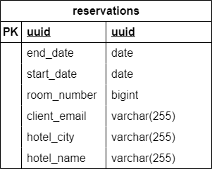

# 📅 Hotel_ML_Reservation_Service - Reservation management

## 📖 Table of Contents
1. [📌 Overview](#-overview)
2. [🔧 Technologies](#️technologies)
3. [📂 Structure of the Code](#-structure-of-the-code)
4. [📊 Diagrams](#-diagrams)

## 📌 Overview
Hotel_ML_Auth_Service is a backend microservice based on **Spring Boot**, that is responsible for creating and modifying a user's reservations for hotel rooms, communicating with Hotel_ML_Rooms_And_Hotels_Service to obtain room cost information and to generate a list of hotels with available rooms on specific dates. It exchanges data with Hotel_ML_APIGateway_Service by sending messages through Apache Kafka brokers.

## ❗ Important information
> To launch an application using the described service, go to:
> ➡️ [Main README](https://github.com/NiczSpeed/HotelML?tab=readme-ov-file#%EF%B8%8F-how-to-run-the-entire-system)

📌 **Key features:**
- ✅ Creating and modifying reservations
- ✅ Exchanging information to update reservation prices
- ✅ AES Encryption for Stored and Brokered Data
---

## 🔧 Technologies
| Component       | Technology |
|----------------|------------|
| **JęzykLanguage**  | Java 21 |
| **Framework**  | Spring Boot 3 |
| **Build Tool**  | Gradle (Kotlin) |
| **Database** | PostgreSQL |
| **Communication** | Apache Kafka |
| **ORM** | Spring Data JPA (Hibernate) |
| **Orchestration** | Docker, Docker Compose |

---

## 📂 Structure of the Code
```plaintext
/backend-service
│── \src\main\java\com\ml\hotel_ml_apigateway_service\
│   ├── configuration/                                      # Microservice configuration layer
│   │   ├── KafkaConsumerConfiguration.java                     # Configuring Apache Kafka Consumer
│   │   ├── KafkaProducerConfiguration.java                     # Apache Kafka Producer Configuration
│   │   ├── KafkaTopicsConfiguration.java                       # Configuring Apache Kafka themes
│   │   ├── ObjectMapperConfiguration.java                      # ObjectMapper configuration
│   ├── dto/                                                # DTO layer
│   │   ├── ReservationDto.java                                 # Dto for Reservation entity
│   ├── exceptions/                                         # Additional exceptions of the microservices
│   │   ├── ErrorWhileDecodeException.java                      # Exception signaling a decoding problem
│   │   ├── ErrorWhileEncodeException.java                      # Exception signaling an encoding problem
│   │   ├── ReservationNotFoundException.java                   # Exception signaling an error when attempting to find a reservation in the database
│   ├── mapper/                                             # Layer mapping of microservice entities and DTOs
│   │   ├── ReservationMapper.java                          # Reservation Mapper
│   ├── model/                                              # Entity classes
│   │   ├── Reservation.java                                    # Entity used to manage reservations
│   ├── repository/                                         # The layer of connection of entities to the database
│   │   ├── ReservationRepository.java                          # Reservation repository
│   ├── service                                             # Business logic layer
│   │   ├── ReservationService.java                             #  The logic of the reservations
│   ├── utils/                                              # Additional functionalities 
│   │   ├── encryptors/                                         # Encryptor layer
│   │   |   ├── DoubleConverter.java                                # Double converter
│   │   |   ├── LocalDateConverter.java                             # LocalDate converter
│   │   |   ├── StringConverter.java                                # String converter
|   |   |── Encryptor.java                                      # Class inheriting EncryptorUtil to provide data encryption
|   |   |── EncryptorUtil.java                                      # A class containing encryption and decryption methods
|   |── HotelMlReservationServiceApplication.java           # Spring Boot main class
│── src/main/resources/application.yml                      # Application configuration
│──.env                                                 # Environment variables for the Docker container
│── Dockerfile                                          # Docker image definition
```
## 📊 Diagrams

### 🗂️ Entity-Relationship Diagram (ERD)
This diagram represents the relationships between entities in the database.


